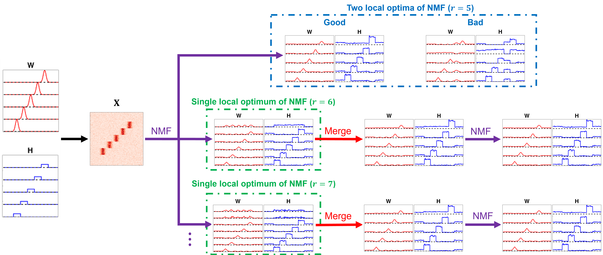
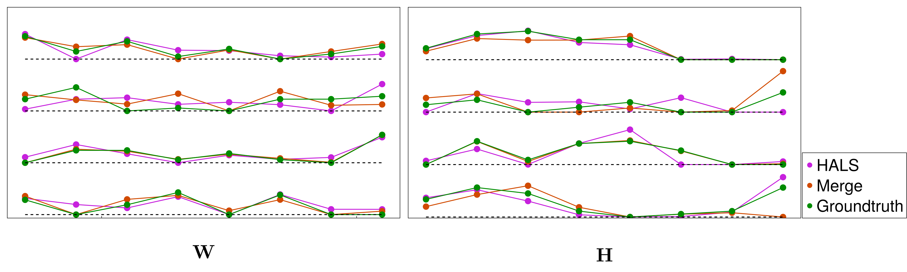

# NMFMerge

<!-- [](https://HolyLab.github.io/NMFMerge.jl/stable/) -->
<!-- [](https://HolyLab.github.io/NMFMerge.jl/dev/) -->
[](https://github.com/HolyLab/NMFMerge.jl/actions/workflows/CI.yml?query=branch%3Amain)
[](https://codecov.io/gh/HolyLab/NMFMerge.jl)
[](https://github.com/JuliaTesting/Aqua.jl)

This package implements the technique in the paper [An optimal pairwise merge algorithm improves the quality and consistency of nonnegative matrix factorization](https://ieeexplore.ieee.org/abstract/document/11071940). It is used to project Non-negative matrix factorization(NMF) solutions from a high-dimensional space to lower dimensional space by optimally and sequentially merging NMF component pairs.

This approach is motivated by the idea that convergence of NMF becomes poor when one is forced to make difficult tradeoffs in describing different features of the data matrix; thus, performing an initial factorization with an excessive number of components grants the opportunity to escape such constraints and reliably describe the full behavior of the data matrix. Later, any redundant or noisy components are identified and merged together.

The concept of NMF-Merge in an illustrative example:


The data matrix is $\mathbf{X}=\mathbf{WH}+\mathbf{N}$, where $\mathbf{W}$ and $\mathbf{H}$ are rank-5 and $\mathbf{N}$ denotes the noise. The 'Good' and 'Bad' factorizations (blue box) represent two local minima reached by rank-5 NMF across 1000 different initializations, while the factorizations in the green boxes denote minima identified by NMF with $r\ge 6$. (These minima were found from every random initialization tested, but uniqueness is not required.) The higher-rank solutions can be merged to produce a rank 5 factorization using NMFMerge. Thus, by first identifying a higher-rank NMF, and then merging to lower rank, you can more reliably identify high-quality solutions. We demonstrate this experimentally in the linked manuscript.


Let's start with a simple demo:

Install the package: type `]` at the `julia>` prompt to enter `pkg>` mode, and type
```julia
pkg> add NMFMerge;
```

We'll use the following ground truth

```math
\begin{align}
        \begin{aligned}
            \mathbf{W} = \begin{pmatrix}
                6 & 0 & 4 & 9 \\
                0 & 4 & 8 & 3 \\
                4 & 4 & 0 & 7 \\
                9 & 1 & 1 & 1 \\
                0 & 3 & 0 & 4 \\
                8 & 1 & 4 & 0 \\
                0 & 0 & 4 & 2 \\
                0 & 9 & 5 & 5
            \end{pmatrix}, \quad
            \mathbf{H}^{\mathrm{T}} = \begin{pmatrix}
                6 & 0 & 3 & 4 \\
                10 & 10 & 5 & 9 \\
                8 & 2 & 0 & 10 \\
                2 & 9 & 2 & 7 \\
                0 & 10 & 4 & 7 \\
                1 & 6 & 0 & 0 \\
                2 & 0 & 0 & 0 \\
                10 & 0 & 8 & 0
            \end{pmatrix}
        \end{aligned}
    \end{align}
```
```julia
using NMF, GsvdInitialization
using NMFMerge
```

Packages:
[NMF](https://github.com/JuliaStats/NMF.jl), 
[GsvdInitialization](https://github.com/HolyLab/GsvdInitialization.jl)

```julia
julia> X = W*H
8×8 Matrix{Int64}:
 84  161  138   83   79   6  12   92
 36  107   38   73   93  24   0   64
 52  143  110   93   89  28   8   40
 61  114   84   36   21  15  18   98
 16   66   46   55   58  18   0    0
 60  110   66   33   26  14  16  112
 20   38   20   22   30   0   0   32
 35  160   68  126  145  54   0   40
```
Running NMF (HALS algorithm) on $\mathbf{X}$ with NNDSVD initialization

```julia
julia> f = svd(X);
julia> result_hals = nnmf(float(X), 4; init=:nndsvd, alg=:cd, initdata=f, maxiter = 10^12, tol = 1e-4);
julia> result_hals.objvalue/sum(abs2, X)
0.00019519131697246967
```

Running NMF Merge on $\mathbf{X}$ with NNDSVD initialization
```julia
julia> result_renmf = nmfmerge(float(X), 5=>4; alg = :cd, maxiter = max_iter);
julia> result_renmf.objvalue/sum(abs2, X);
0.00010318497977267333
```
The relative fitting error between NMF solution and ground truth of NMFMerge is about half that of standard NMF. Thus, NMFMerge helps NMF converge to a better local minimum.


The comparison between standard NMF(HALS) and NMFMerge:


Consistent with the conclusion from the comparision of ralative fitting error, the figure suggests that the results of NMFMerge(Brown) fits the ground truth(Green) better than standard NMF(Magenta). (At 44 points out of 64 points, NMFMerge results are closer to the ground truth.)


---------------------------

## Functions

**nmfmerge**(X, ncomponents; tol_final=1e-4, tol_intermediate=sqrt(tol_final), W0=nothing, H0=nothing, kwargs...)
This function performs "NMF-Merge" on 2D data matrix ``X``.

Arguments:

``ncomponents::Pair{Int,Int}``: in the form of ``n1 => n2``, merging from ``n1`` components to ``n2``components, where ``n1`` is the number of components for overcomplete NMF, and ``n2`` is the number of components for initial and final NMF.

Alternatively, ``ncomponents`` can be an integer denoting the final number of components. In this case, ``nmfmerge`` defaults to an approximate 20% component excess before merging.


Keyword arguments:

``tol_final``： The tolerence of final NMF, default: $10^{-4}$

``tol_intermediate``: The tolerence of initial and overcomplete NMF, default: $\sqrt{\mathrm{tol\\_final}}$


``W0``: initialization of initial NMF, default: ``nothing``

``H0``: initialization of initial NMF, default: ``nothing``

If one of ``W0`` and ``H0`` is ``nothing``, NNDSVD is used for initialization.


Other keywords arguments are passed to ``NMF.nnmf``.

-----
Suppose you have the NMF solution ``W`` and ``H`` with ``r`` componenents, **merge_pq** function can merge ``r`` components down. The details of this function is:

**merge_pq**(W, H; nstop=1, errstop=typemax(...))

This function merges components in ``W`` and ``H`` (columns in ``W`` and rows in ``H``). Merging stops at whichever of the two criteria ``nstop`` and ``errstop`` is reached first.

The keyword ``nstop`` is a floor on the number of components: merging never produces fewer than ``nstop`` components. The default ``nstop=1`` merges as far as possible.

The keyword ``errstop`` stops merging early once the cheapest available merge would cost more than ``errstop`` (compared against the merge penalty), leaving more than ``nstop`` components. Its default disables early stopping.

To use this function:
`Wmerge, Hmerge, mergeseq = merge_pq(W, H; nstop=n)`, where ``Wmerge`` and ``Hmerge`` are the merged results with ``n`` components. ``mergeseq`` is the sequence of merges as ``(id1, id2, err)`` tuples, where ``id1`` and ``id2`` are the merged component ids and ``err`` is the reconstruction error incurred by that merge. Merging all the way down (``nstop=1``) and inspecting the ``err`` values lets you locate a "knee" at which to stop, then replay the corresponding prefix of ``mergeseq`` with ``merge_replay``.

-----

Before merging components, the columns in ``W`` are required to be normalized to 1. The normalization can be realized by **colnormalize** function or any other method you like.


**colnormalize**(W, H, p=2)


This function normalize ``||W[:, i]||_p = 1`` for ``i in 1:size(W, 2)``. Our manuscript uses ``p=2`` throughout.


To use this function:
`Wnormalized, Hnormalized = colnormalize(W, H, p)`

-----

If you already have a merge sequence and want to merge from ``size(W, 2)`` components to ``n`` components, you can use the function:

**merge_replay**(W, H, mergeseq)

To use this function:

`Wmerge, Hmerge = merge_replay(W, H, mergeseq)`, where ``Wmerge`` and ``Hmerge`` are the merged results. Each entry of ``mergeseq`` supplies the pair of ids ``(id1, id2)`` to merge; any further fields are ignored, so the ``(id1, id2, err)`` triples returned by ``merge_pq`` can be replayed directly.

## Citation
Thanks for citing this work! See the "Cite this repository" link in the "About" bar for format options.

