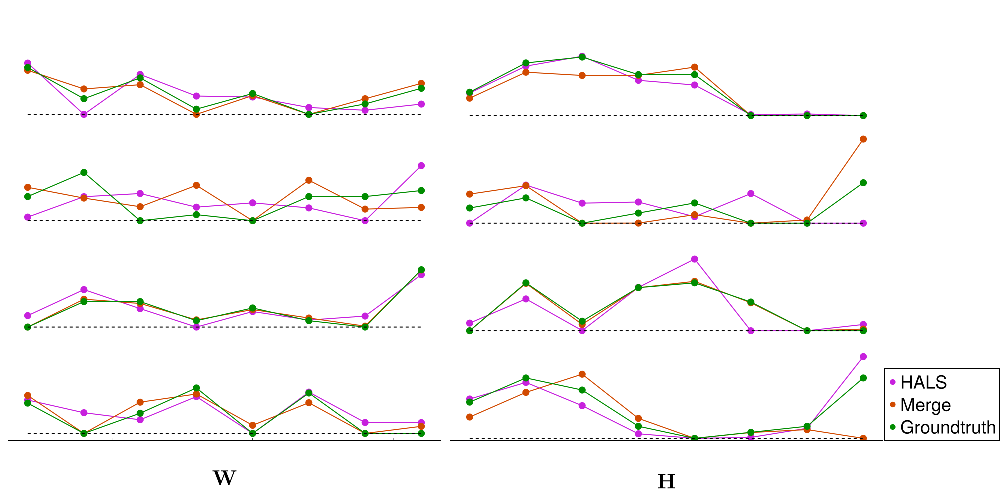

# NMFMerge

<!-- [](https://HolyLab.github.io/NMFMerge.jl/stable/) -->
<!-- [](https://HolyLab.github.io/NMFMerge.jl/dev/) -->
[](https://github.com/HolyLab/NMFMerge.jl/actions/workflows/CI.yml?query=branch%3Amain)
[](https://codecov.io/gh/HolyLab/NMFMerge.jl)

This package includes the code of the paper 'An optimal pairwise merge algorithm improves the quality and consistency of nonnegative matrix factorization`. It is used to project Non-negative matrix factorization(NMF) solutions from high-dimensional space to lower dimensional space by optimally merging NMF components in higher dimensional space.

This approach is motivated by the idea that convergence of NMF becomes poor when one is forced to make difficult tradeoffs in describing different features of the data matrix; thus, performing an initial factorization with an excessive number of components grants the opportunity to escape such constraints and reliably describe the full behavior of the data matrix. Later, any redundant or noisy components are identified and merged together.

Let's start with a simple demo:
Prerequisite: NMF.jl, GsvdInitialization

Install the package
```julia
julia>] add NMFMerge;
```

Considering the ground truth

```math
\begin{align} 
        \begin{aligned}
            \mathbf{W} = \begin{pmatrix}
                6 & 0 & 4 & 9 \\
                0 & 4 & 8 & 3 \\
                4 & 4 & 0 & 7 \\
                9 & 1 & 1 & 1 \\
                0 & 3 & 0 & 4 \\
                8 & 1 & 4 & 0 \\
                0 & 0 & 4 & 2 \\
                0 & 9 & 5 & 5 
            \end{pmatrix}, \quad
            \mathbf{H}^{\mathrm{T}} = \begin{pmatrix}
                6 & 0 & 3 & 4 \\
                10 & 10 & 5 & 9 \\
                8 & 2 & 0 & 10 \\
                2 & 9 & 2 & 7 \\
                0 & 10 & 4 & 7 \\
                1 & 6 & 0 & 0 \\
                2 & 0 & 0 & 0 \\
                10 & 0 & 8 & 0
            \end{pmatrix}
        \end{aligned}
    \end{align}
```
```julia
using NMF, GsvdInitialization
using NMFMerge
```

```julia
julia> X = W*H
8×8 Matrix{Int64}:
 84  161  138   83   79   6  12   92
 36  107   38   73   93  24   0   64
 52  143  110   93   89  28   8   40
 61  114   84   36   21  15  18   98
 16   66   46   55   58  18   0    0
 60  110   66   33   26  14  16  112
 20   38   20   22   30   0   0   32
 35  160   68  126  145  54   0   40
```
Running NMF (HALS algorithm) on $\mathbf{X}$ with NNDSVD initialization

```julia
julia> f = svd(X);
julia> result_hals = nnmf(float(X), 4; init=:nndsvd, alg=:cd, initdata=f, maxiter = 10^12, tol = 1e-4);
julia> result_hals.objvalue/sum(abs2, X)
0.00019519131697246967
```

Running NMF Merge on $\mathbf{X}$ with NNDSVD initialization
```julia
julia> result_renmf = nmfmerge(float(X), 5=>4; alg = :cd, maxiter = max_iter);
julia> result_renmf.objvalue/sum(abs2, X);
0.00010318497977267333
```
The relative fitting error between NMF solution and ground truth of NMFMerge is about half that of standard NMF. Thus, NMFMerge helps NMF converge to a better local minimum.


The comparison between standard NMF(HALS) and Merge:


Consistent with the conclusion from the comparision of ralative fitting error, the figure suggests that the results of NMFMerge(Brown) fits the ground truth(Green) better than standard NMF(Magenta). (At 44 points out of 64 points, NMFMerge results are closer to the ground truth.)


---------------------------

## Functions

**nmfmerge**(X, ncomponents; tol_final=1e-4, tol_intermediate=sqrt(tol_final), W0=nothing, H0=nothing, kwargs...)
This function performs "NMF-Merge" on 2D data matrix ``X``.

Arguments:

``ncomponents::Pair{Int,Int}``: in the form of ``n1 => n2``, merging from ``n1`` components to ``n2``components, where ``n1`` is the number of components for overcomplete NMF, and ``n2`` is the number of components for initial and final NMF.

Alternatively, ``ncomponents`` can be an integer denoting the final number of components. In this case, ``nmfmerge`` defaults to an approximate 20% component excess before merging.


Keyword arguments:

``tol_final``： The tolerence of final NMF, default:``10^{-4}``

``tol_intermediate``: The tolerence of initial and overcomplete NMF, default: $\sqrt{\mathrm{tol\\_final}}$


``W0``: initialization of initial NMF, default: ``nothing``

``H0``: initialization of initial NMF, default: ``nothing``

If one of ``W0`` and ``H0`` is ``nothing``, NNDSVD is used for initialization.


Other keywords arguments are passed to ``NMF.nnmf``.

-----
Suppose you have the NMF solution ``W`` and ``H`` with ``r`` componenents, **colmerge2to1pq** function can merge ``r`` components to ``n``components. The details of this function is:

**colmerge2to1pq**(W, H, n)

This function merges components in ``W`` and ``H`` (columns in ``W`` and rows in ``H``) from original number of components to ``n`` components (``n``columns and rows left in ``W`` and ``H`` respectively).

To use this function:
`Wmerge, Hmerge, mergeseq = colmerge2to1pq(W, H, n)`, where ``Wmerge`` and ``Hmerge`` are the merged results with ``n`` components. ``mergeseq`` is the sequence of merge pair ids ``(id1, id2)``, which is the components id of single merge.
-----
Before merging components, the columns in ``W`` are required to be normalized to 1. The normalization can be realized by **colnormalize** function or any other method you like.


**colnormalize**(W, H, p=2)


This function normalize ``||W[:, i]||_p = 1`` for ``i in 1:size(W, 2)``. Our manuscript uses ``p=2`` throughout.


To use this function:
`Wnormalized, Hnormalized = colnormalize(W, H, p)`
-----
If you already have a merge sequence and want to merge from ``size(W, 2)`` components to ``n`` components, you can use the function:

**mergecolumns**(W, H, mergeseq; tracemerge)

keyword argurment ``tracemerge``: save ``Wmerge`` and ``Hmerge`` at each merge stage if ``tracemerge=true``. default ``tracemerge=false``.

To use this function:

`Wmerge, Hmerge, WHstage, Err = mergecolumns(W, H, mergeseq; tracemerge)`, where ``Wmerge`` and ``Hmerge`` are the merged results. ``WHstage::Vector{Tuple{Matrix, Matrix}}`` includes the results of each merge stage. ``WHstage=[]`` if ``tracemerge=false``. ``Err::Vector`` includes merge penalty of each merge stage.

## Citation
The code is welcomed to be used in your publication, please cite:


