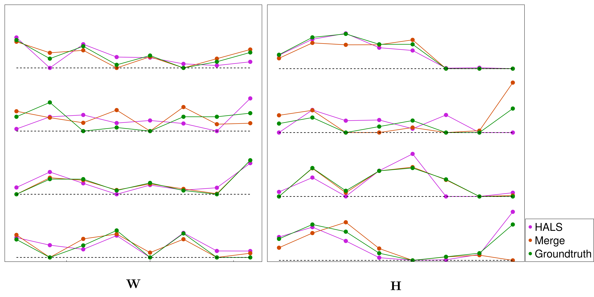

```@meta
CurrentModule = NMFMerge
```

# NMFMerge.jl

NMFMerge improves nonnegative matrix factorization (NMF) by *over-factorizing*
and then merging components in pairs. Factorizing a data matrix ``X \approx WH``
with more components than ultimately desired, and then optimally and
sequentially merging the closest component pairs, tends to reach better and more
reproducible optima than factorizing directly into the target number of
components.

The method is described in [An optimal pairwise merge algorithm improves the
quality and consistency of nonnegative matrix
factorization](https://ieeexplore.ieee.org/abstract/document/11071940)
(Guo & Holy, IEEE Trans. Signal Process. 2025,
[doi:10.1109/TSP.2025.3585893](https://doi.org/10.1109/TSP.2025.3585893)).

## Why merging helps

Convergence of NMF becomes poor when the factorization is forced to make
difficult tradeoffs in describing different features of the data matrix.
Performing an initial factorization with an excess of components grants the
opportunity to escape such constraints and describe the full behavior of the
data; redundant or noisy components are then identified and merged together.


Here the data matrix is ``X = WH + N``, where ``W`` and ``H`` are rank 5 and
``N`` is noise. The "Good" and "Bad" factorizations (blue box) are two local
minima reached by rank-5 NMF across 1000 different initializations, while the
factorizations in the green boxes are minima found by NMF with ``r \ge 6``. The
higher-rank solutions can be merged to produce a rank-5 factorization. Thus, by
first computing a higher-rank NMF and then merging to lower rank, you more
reliably identify high-quality solutions.

## Installation

NMFMerge is a registered package. From the Julia REPL, type `]` to enter
package mode and run:

```julia
pkg> add NMFMerge
```

## Quick start

Start from a known rank-4 ground truth and form the data matrix ``X = WH``:

```julia
using NMFMerge, NMF, GsvdInitialization, LinearAlgebra

W = [6 0 4 9; 0 4 8 3; 4 4 0 7; 9 1 1 1; 0 3 0 4; 8 1 4 0; 0 0 4 2; 0 9 5 5]
H = [6 10 8 2 0 1 2 10;
     0 10 2 9 10 6 0 0;
     3 5 0 2 4 0 0 8;
     4 9 10 7 7 0 0 0]
X = W * H
```

Standard NMF (HALS) with NNDSVD initialization gives one reconstruction error:

```julia
julia> f = svd(X);

julia> result_hals = nnmf(float(X), 4; init=:nndsvd, alg=:cd, initdata=f, maxiter=10^6, tol=1e-4);

julia> result_hals.objvalue / sum(abs2, X)     # relative fitting error
0.00019519131697246967
```

NMF-Merge — factorize with 5 components, then merge down to 4 — reaches a better
local minimum:

```julia
julia> result_merge = nmfmerge(float(X), 5 => 4; alg=:cd, maxiter=10^6);

julia> result_merge.objvalue / sum(abs2, X)
0.00010318497977267728
```

The relative fitting error of NMF-Merge is about half that of standard NMF, so
NMF-Merge helps NMF converge to a better solution. (The merge step draws on a
randomized truncated SVD, so the exact value varies slightly from run to run.)



The figure shows that NMF-Merge (brown) fits the ground truth (green) more
closely than standard NMF (magenta): at 44 of 64 points, the NMF-Merge result is
closer to the ground truth.

## Lower-level workflow

[`nmfmerge`](@ref) runs the whole pipeline, but the building blocks are exported
so you can drive merging yourself, for example when choosing the number of
components:

1. [`colnormalize`](@ref) rescales the columns of `W` to unit 2-norm (merging
   requires unit-norm columns), pushing the scale into `H` so that `W * H` is
   unchanged.
2. [`merge_pq`](@ref) merges a normalized factorization down to a chosen number
   of components and records the sequence of merges, including the reconstruction
   error each merge incurs. Merging all the way to one component and inspecting
   those errors might provide hints about an appropriate number of components.
3. [`merge_replay`](@ref) replays a prefix of that merge sequence, reproducing
   the factors `merge_pq` would have returned had it stopped at the
   corresponding number of components.

See the [API reference](@ref "API reference") for full signatures and examples.

## Citation

If you use this package, please cite the publication above; see the "Cite this
repository" link in the GitHub "About" bar for format options.
